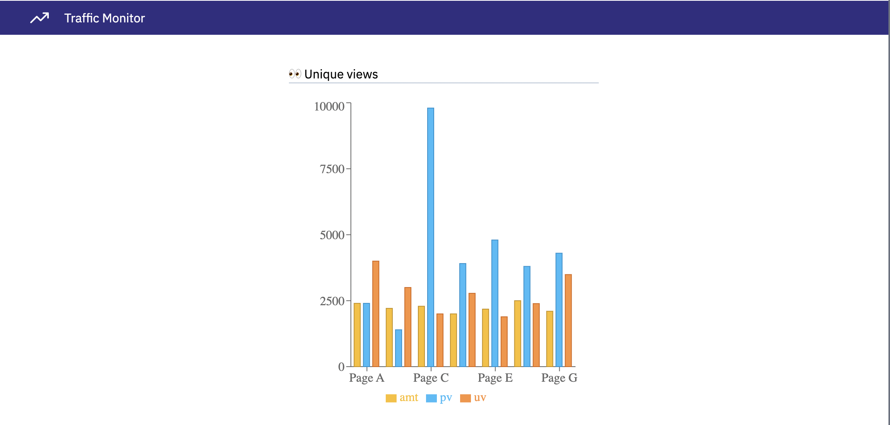

# Atri Python Developer Assignment

This repository contains a simple full-stack app built using Atri framework. 

## Demo

## Setup

### First time setup
Follow the instructions provided in [CONTRIBUTING.md](CONTRIBUTING.md)  to set up the project in your system.

### Second session onwards
Every time you return to work on an existing project, make sure you follow the instructions [here](https://docs.atrilabs.com/existing-project/dev-flow-existing-proj).

## Need help?

📚 Read the [Docs](https://docs.atrilabs.com/)

👩‍💻 [Create first Atri app](https://docs.atrilabs.com/getting-started/create-app) to understand the framework

❓ Check frequently asked questions about installation in [Discussions](https://github.com/Atri-Labs/atrilabs-engine/discussions/categories/help-installation-start)

💬 If you do not find your question in Discussions, ask us in our [Slack community](https://join.slack.com/t/atricommunity/shared_invite/zt-1e756m1at-bZBxngvw7KWWO0riI4pc0w)

🎥 Watch video tutorials on [YouTube](https://www.youtube.com/channel/UC1uR2Q5x_8olWS_Y4PdK1Bw)

🧭 Follow Atri Labs on [LinkedIn](https://www.linkedin.com/company/atri-labs)

⭐️ Star [Atri framework](https://github.com/Atri-Labs/atrilabs-engine) if you find it helpful! 😎